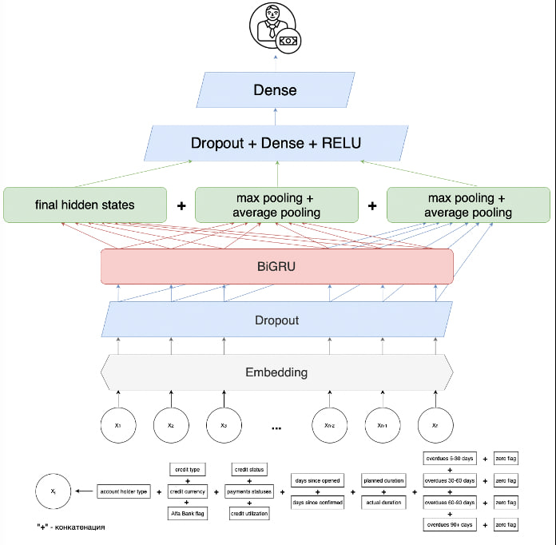

# credit-scoring-with-rnn
# Проект по кредитному скорингу

## 1. Формулировка задачи

Целью проекта: разработка модели кредитного скоринга, которая позволит с высокой точностью предсказывать вероятность дефолта по кредиту. Модель будет обучена на данных о кредитной истории клиентов, включая такие признаки, как сумма кредита, срок кредита, процентная ставка, статус кредита и др. Основная сложность заключается в обучении на небольшом объеме данных о выданных кредитах и одновременном использовании большего объема исторических данных.

Мотивация: Хотим оценивать риски выдачи кредитов потенциальному заемщику.

## 2. Данные

Источники данных:  Записи кредитной истории Альфа Банка (https://ods.ai/competitions/dl-fintech-bki/data).

Особенности:  Несколько десятков миллионов транзакций, объемом порядка 12 гигабайт в формате parquet

Возможные проблемы: Необходимо использовать информацию, доступную на момент подачи заявки на кредит.

## 3. Подход к моделированию
### Модели и библиотеки: GRU (BiGRU)
Модель будет обучаться на наборе данных, содержащем кредитные истории клиентов. Данные будут представлены в виде последовательностей исторических кредитов каждого клиента, преобразованных в векторное представление с использованием эмбеддингов для категориальных признаков.

### Архитектура:
Модель будет использовать RNN с GRU слоями для обработки последовательностей кредитной истории. Это позволит определять временные зависимости между различными кредитами в истории клиента. Все категориальные признаки кредитной истории будут представлены в виде эмбеддингов, которые будут сконкатенированы для формирования единого векторного представления каждого кредита. Затем вектора подаются в GRU рекуррентный слой. В качестве выхода GRU слоя используется последнее скрытое состояние, которое подается в полносвязный слой, используемое как классификатора для определения вероятности дефолта.

## 4. Способ предсказания

После обучения модель будет интегрирована в продакшен пайплайн, который включает в себя предобработку данных, получение предсказаний от модели и их интерпретацию. 
Пайплайн планируется следующий: 
1) Загрузка и агрегация новых данных. 
2) Аггрегация новых данных, поддержание исторических предобработанных данных. 
3) Инференс модели

## Применение

Финальным применением модели может быть улучшение процесса оценки кредитоспособности заемщиков.

